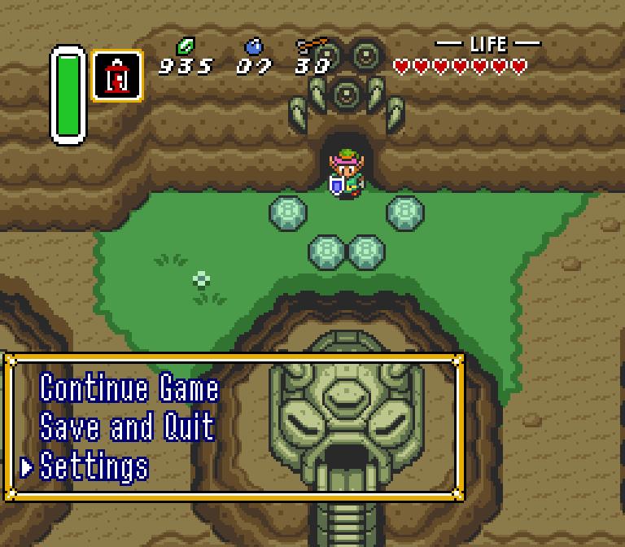
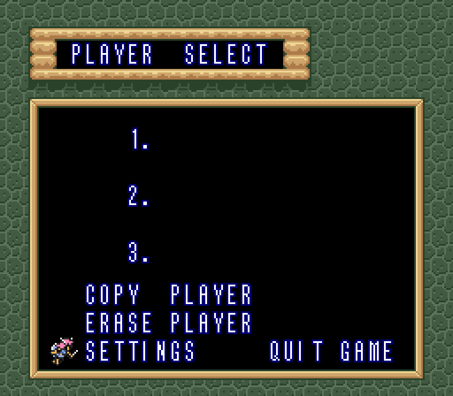
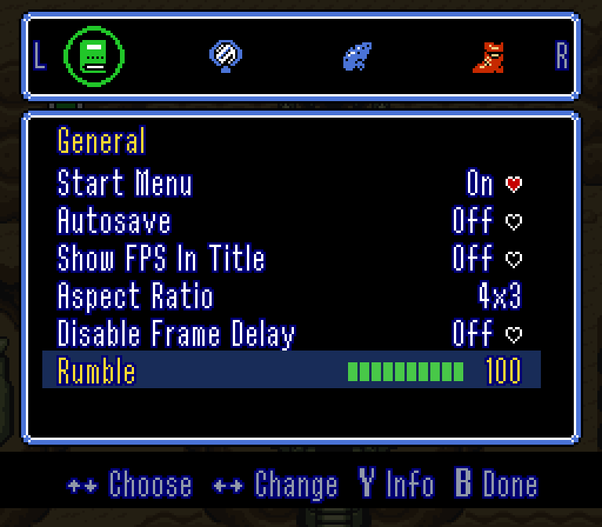
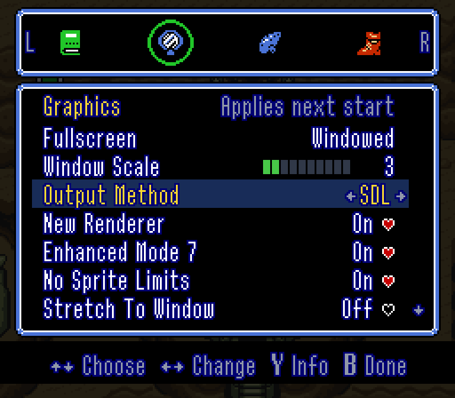
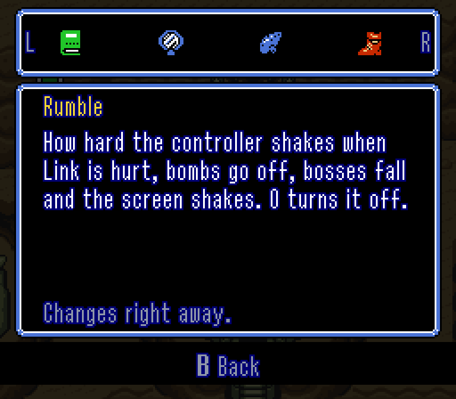
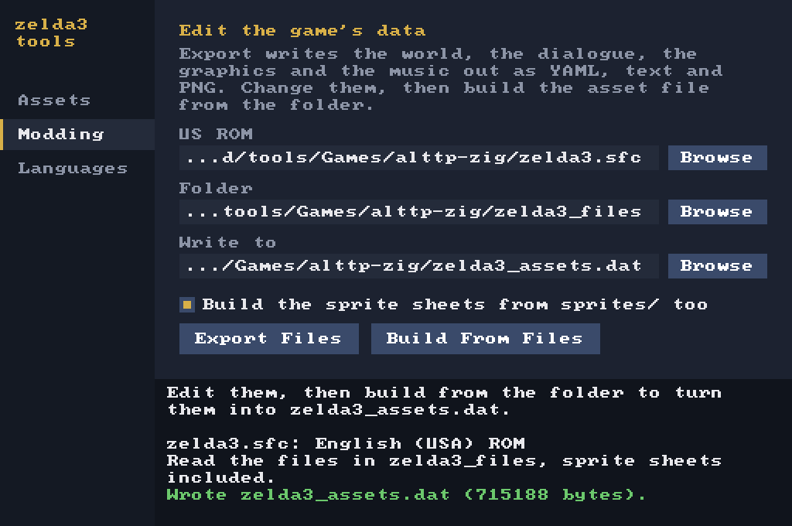
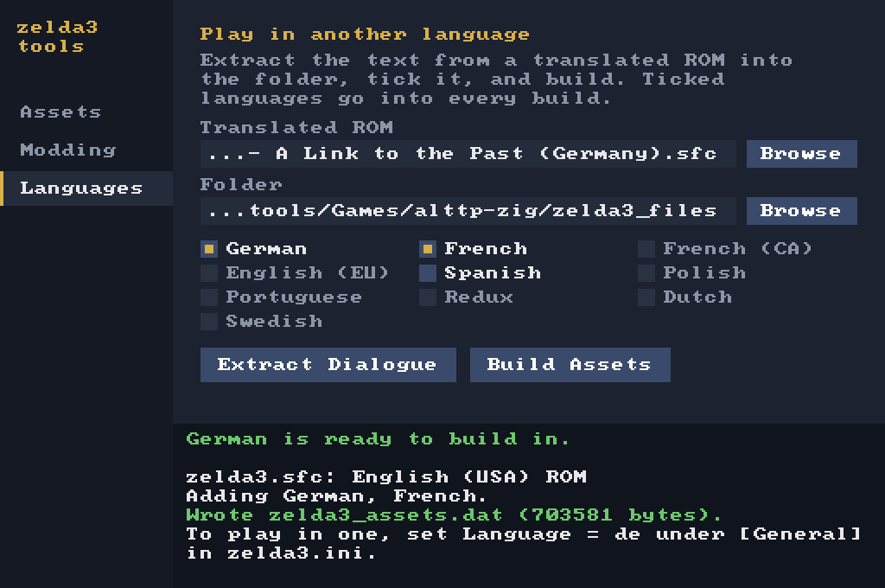

# alttp-zig

A Link to the Past, reimplemented from scratch and ported to Zig.

This is a fork of [snesrev/zelda3](https://github.com/snesrev/zelda3), the C
reimplementation of the whole game. I ported it to Zig and added a start menu,
a settings screen inside the game, controller rumble, and `zelda3-tools`, an
asset toolbox with a window and a command line.

You bring your own US ROM. No game data ships here, and once the assets are
built the ROM isn't needed again.

Upstream's Discord: https://discord.gg/AJJbJAzNNJ

## Downloads

[Releases](https://github.com/YeOldPress/alttp-zig/releases) have two
downloads for each platform, both with SDL3 inside:

| | Game | Tools |
| --- | --- | --- |
| macOS 11+, Apple Silicon | `alttp-zig-*-macos-arm64.zip` | `zelda3-tools-*-macos-arm64.zip` |
| Linux x86_64, glibc 2.35+ | `alttp-zig-*-x86_64.AppImage` | `zelda3-tools-*-x86_64.AppImage` |
| Windows x86_64 | `alttp-zig-*-windows-x86_64.zip` | `zelda3-tools-*-windows-x86_64.zip` |

The game is all you need to play: start it, give it your ROM, press Play. The
tools are for modding and extra languages.

The Mac app and the AppImage keep `zelda3.ini`, `zelda3_assets.dat` and your
saves in `~/Library/Application Support/alttp-zig` or
`~/.local/share/alttp-zig`, and the tools default to the same place. On
Windows everything stays in the game's folder.

## Building

You need [Zig 0.16.0](https://ziglang.org/download/) and SDL3.

```sh
sudo apt install libsdl3-dev   # Ubuntu 25.10 or newer
sudo dnf install SDL3-devel    # Fedora
sudo pacman -S sdl3            # Arch
brew install sdl3              # macOS

git clone https://github.com/YeOldPress/alttp-zig
cd alttp-zig
zig build run
```

Put your ROM at `zelda3.sfc` in the repository root, or drag it onto the window
when asked. Both `zelda3` and `zelda3-tools` land in `zig-out/bin`.

```sh
zig build run                      # build and start the game
zig build tools                    # build and open zelda3-tools
zig build assets                   # build zelda3_assets.dat, no window
zig build test                     # the tests
zig build -Doptimize=ReleaseSafe   # a faster build
```

On Windows, take `SDL3-devel-<version>-mingw.zip` from
[SDL's releases](https://github.com/libsdl-org/SDL/releases) and point the
build at it, then copy `SDL3.dll` next to the binaries:

```
zig build -Dsdl-include=<sdl>\x86_64-w64-mingw32\include ^
          -Dsdl-lib=<sdl>\x86_64-w64-mingw32\bin
```

`-Dsdl-lib` points at `bin` on purpose: zig links `SDL3.dll` directly.
The same flags with `-Dtarget=x86_64-windows` cross-compile from Linux or macOS.

## The start menu

`zelda3` opens on a menu for settings, features and building the asset file.
Press Play and the game starts in the same window. It also shows whether the
asset file is verified, different or missing, and won't start the game on
assets it can't verify.

Turn it off with `StartMenu = 0` in `[General]`, from the menu itself, or from
the settings inside the game. Arrows or the pad to move, Enter or A to pick,
S or X to save, Esc or B to go back.

## Settings inside the game

Press Start, then Select, and choose **Settings**. It's also on the player
select screen. Same settings as the start menu, drawn with the game's own
graphics.

<table>
  <tr>
    <td></td>
    <td></td>
  </tr>
  <tr>
    <td></td>
    <td></td>
  </tr>
  <tr>
    <td></td>
    <td></td>
  </tr>
</table>

L/R changes tab, Up/Down picks, Left/Right or A changes, Y explains, B or
Start saves and goes back. Most settings apply right away; the ones that can't
say "Applies next start".

## Rumble

The SNES had no rumble, so the port watches the game and shakes the pad to
match: Link getting hurt, explosions, screen shakes, bosses dying, heavy things
moving, arrows landing, doors opening, the hammer and the hookshot. It only
reads game state, so the port still matches the original frame for frame.
`Rumble` in `[General]` sets the strength; `zelda3 --pad-info` says whether
your pad has a motor.

## Playing

| Button | Key | | Key | Action |
| --- | --- | --- | --- | --- |
| D-pad | Arrows | | Tab | Turbo |
| Start | Enter | | P | Pause |
| Select | Right Shift | | Alt+Enter | Fullscreen |
| A | X | | Ctrl+Up/Down | Window size |
| B | Z | | Shift+= / Shift+- | Volume |
| X | S | | F1-F10 | Load snapshot (Shift saves, Ctrl replays) |
| Y | A | | W | Fill health and magic |
| L | C | | Ctrl+E | Walk through walls |
| R | V | | Ctrl+R | Reset |

Keys and the gamepad are rebindable in `zelda3.ini`, which lists the rest of
the debug keys.

- `zelda3 <rom>` runs the original machine code alongside the port and compares
  RAM every frame. This is how the port is verified.
- `zelda3 --config <path>` uses another ini.
- `zelda3 --build-assets` builds the asset file and exits.
- `zelda3 --data-dir` prints where the ini, assets and saves live.
- `zelda3 --render <chapter> <script> <out.bmp>` plays a button script from a
  snapshot in `saves/ref` with no window and saves the last frame.

## MSU audio

Point `MSUPath` at a pack and set `EnableMSU`:

| Value | Files | Tracks |
| --- | --- | --- |
| `true` | `<MSUPath><n>.pcm` | plain |
| `deluxe` | `<MSUPath><n>.pcm` | deluxe |
| `opuz` | `<MSUPath><n>.opuz` | plain |
| `deluxe-opuz` | `<MSUPath><n>.opuz` | deluxe |

Deluxe packs have a track per place rather than per song; only use it with a
deluxe pack. MSU needs `AudioChannels = 2`, and it sets the audio rate itself.

## Randomizer

Generate a seed on [alttpr.com](https://alttpr.com) from the Japanese 1.0 ROM
(MD5 `03a63945398191337e896e5771f77173`), then drop the seed on the start menu
or run `zelda3 seed.sfc`. A seed changes the game's own code, so it isn't
played by the port: it runs in the SNES emulator the port is verified
against, exactly as the randomizer built it. Snapshots and cheats are off,
and the save goes next to the seed as a `.srm` file.

Some of the port's extras still come along, because they only watch the game:

- **Rumble**, the same as in the port.
- **Widescreen**. Rooms and areas show as far as
  they go; outdoors the edges can briefly show stale tiles while scrolling,
  and enemies still vanish at the original screen edge.
- **MSU-1**: put `seed-1.pcm`, `seed-2.pcm` and so on (or `.opuz`) next to
  `seed.sfc`, the usual way randomizer packs are named, or it uses `MSUPath`
  when `EnableMSU` is on. The seed's own code picks the tracks.

Before a seed starts, a short options screen asks about widescreen, rumble,
MSU-1 and the tracker. Those are kept in `[Randomizer]` in `zelda3.ini`, apart
from the normal game's settings.

The item tracker follows along by itself, reading the save data every frame:
items, all 13 dungeons (checks left, keys, big key, map, compass, boss) and
both world maps with every check on them. Its icons and maps come from the
seed. It goes beside the game, over it, in its own window, or nowhere, and T
switches between those while playing.


Everything to do with the assets besides playing: building them, exporting
them to edit, building them back, and adding languages. Run it with no
arguments for the window, or with a command.

<table>
  <tr>
    <td></td>
    <td></td>
  </tr>
</table>

- **Assets** builds and checks `zelda3_assets.dat`, and identifies ROMs.
- **Modding** exports the overworld and dungeons as YAML, the dialogue as text,
  Link, the font and the sprite sheets as PNG, and the music to look at. Edit
  them and build the asset file from the folder.
- **Languages** extracts the text and font from a translated ROM and builds it
  in beside the English. Set `Language = de` (or whichever) in `zelda3.ini`
  to play in it.

```sh
zelda3-tools build --rom zelda3.sfc --out zelda3_assets.dat
zelda3-tools export --rom zelda3.sfc --out my_mod
zelda3-tools build --from my_mod [--sprites-from-png]
zelda3-tools extract-dialogue --rom german.sfc --out langs
zelda3-tools build --languages de,fr --lang-dir langs
zelda3-tools help
```

Unedited files build exactly the standard asset file, and mistakes are
reported by file and line. Known ROMs: the US, German, French, French Canadian
and European releases, and the Spanish, Polish, Portuguese, Dutch, Swedish and
English Redux fan translations. Only the US ROM builds the asset file. Its
SHA-256 is `66871d66be19ad2c34c927d6b14cd8eb6fc3181965b6e517cb361f7316009cfb`.

## Checking the port

```sh
zig run other/check_ancilla_parity.zig
```

Builds the original C from commit `fbbb3f9` beside the port and compares them.

## What's different from the original

From upstream: widescreen, a sharper world map, pixel shaders, MSU audio, item
switching with L and R and a second item on X, and optional gameplay tweaks
and bug fixes under `[Features]` in `zelda3.ini`.

Added here: the start menu, the in-game settings, rumble, a quit option on the
player select screen, and `zelda3-tools`.

## Questions nobody asked

**Why Zig?**

Because I love programming in it.

**Why not Rust?**

No.

## Credits

- **snesrev**, who reverse engineered the game and wrote the C
  reimplementation this is ported from, and the upstream contributors:
  FitzRoyX, Keaton Greve, xander-haj, Patrick Mollohan, DaBanana64, Jason
  Shearer, KiritoDev, Nutzzz, UltraHDR, DPS2004, David Girón, Goodlyay, Jarrod
  Makin, Rémy F, Stefan Sperling, Thomas, Timár Csaba, VictorXPDE, hgdagon,
  liffy, makolyte and vanfanel.
- **spannerism**, for the Zelda 3 JP disassembly, and the authors of the other
  disassemblies that named the game's functions and variables.
- **elzo_d**, for the SNES PPU and DSP from
  [LakeSnes](https://github.com/elzo-d/LakeSnes), which upstream optimized.
- The fan translators behind the
  [Spanish](https://www.romhacking.net/translations/2195/),
  [Polish](https://www.romhacking.net/translations/5760/),
  [Portuguese](https://www.romhacking.net/translations/6530/),
  [Dutch](https://www.romhacking.net/translations/1124/),
  [Swedish](https://www.romhacking.net/translations/982/) and English Redux
  ([1](https://www.romhacking.net/translations/6657/),
  [2](https://www.romhacking.net/hacks/2594/)) versions the tools can read.
- [SDL](https://libsdl.org), [Opus](https://opus-codec.org) by the Xiph.Org
  Foundation, and [stb_image](https://github.com/nothings/stb) by Sean Barrett.
- Nintendo, for the game.

## License

MIT, see `LICENSE.txt`, which keeps the original notices: Copyright (c) 2022
snesrev and Copyright (c) 2021 elzo_d.

Vendored in `third_party/`: Opus 1.3.1 (3-clause BSD, `COPYING` there and in
`LICENSE.txt`), stb_image 2.27 (MIT or public domain), and a generated OpenGL
loader. SDL3 and OpenGL are system dependencies.

No game assets are distributed here.
