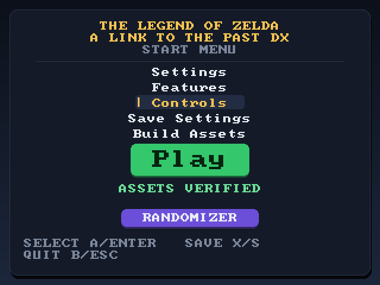
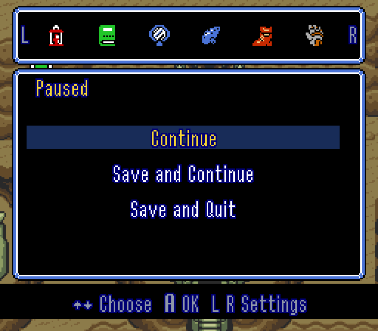

# ALTTP-DX

*The Legend of Zelda: A Link to the Past*, rebuilt to run natively on PC,
with the extras a modern re-release would have.



- **Widescreen**, with a camera that keeps the whole wide picture in the area
  you're in and a HUD that moves out to the edges
- **Rumble** for hits, explosions, bosses, the hammer and more
- **MSU-1** music packs, including deluxe packs and compressed `.opuz` packs
- **Settings everywhere:** a start menu before the game, and the same settings
  inside it, each with a description
- **Quality of life:** item switching with L and R, a second item on X, Save
  and Continue, and optional gameplay tweaks and bug fixes
- **Randomizer:** play [alttpr.com](https://alttpr.com) seeds with an item
  tracker that follows along by itself
- **Modding and languages** with `zelda3-tools`

You bring your own US ROM. No game data ships here, and once the assets are
built the ROM isn't needed again.

## Download

[Releases](https://github.com/YeOldPress/alttp-dx/releases) have the game and
the tools for each platform, with everything they need inside:

| | Game | Tools |
| --- | --- | --- |
| macOS 11+, Apple Silicon | `alttp-dx-*-macos-arm64.zip` | `zelda3-tools-*-macos-arm64.zip` |
| Linux x86_64, glibc 2.35+ | `alttp-dx-*-x86_64.AppImage` | `zelda3-tools-*-x86_64.AppImage` |
| Windows x86_64 | `alttp-dx-*-windows-x86_64.zip` | `zelda3-tools-*-windows-x86_64.zip` |

The game is all you need to play. The **Nightly** release is the latest work
in progress, rebuilt overnight whenever something's changed; the numbered
releases are the ones to play.

The Mac app isn't notarized, so the first time, run
`xattr -dr com.apple.quarantine /Applications/ALTTP-DX.app` or allow it under
System Settings → Privacy & Security. On Linux, `chmod +x` the AppImage first.

## Playing

Start the game, give it your ROM when it asks (drag the `.sfc` onto the
window), and press **Play**. It builds its assets from the ROM once and checks
them every time after that.

| Button | Key | | Key | Action |
| --- | --- | --- | --- | --- |
| D-pad | Arrows | | Alt+Enter | Fullscreen |
| Start | Enter | | P | Pause |
| Select | Right Shift | | Ctrl+Up/Down | Window size |
| A | X | | Shift+= / Shift+- | Volume |
| B | Z | | | |
| X | S | | | |
| Y | A | | | |
| L / R | C / V | | | |

Everything can be rebound, from **Controls** in the start menu or in the game.

The Mac app and the AppImage keep `zelda3.ini`, the assets and your saves in
`~/Library/Application Support/alttp-dx` or `~/.local/share/alttp-dx`. On
Windows everything stays in the game's folder. If you played it back when it
was called alttp-zig, your old folder moves over by itself on the first start.

## Settings

**The start menu** opens before the game: Settings, Features, Controls,
building the assets, and Play. Press Y or I on any setting to see what it
does. Turn the menu off with **Start Menu** in Settings.

**In the game**, press Select. The menu slides down with Continue, Save and
Continue, and Save and Quit, and the settings on the pages after it, L and R
to move between them. Select again puts it away. The player select screen has
the settings too.

<table>
  <tr>
    <td></td>
    <td></td>
  </tr>
  <tr>
    <td></td>
    <td></td>
  </tr>
</table>

Most settings take effect straight away. The ones that can't say so.

### MSU-1

Point `MSUPath` in `zelda3.ini` at a pack and set `EnableMSU`:

| Value | Files | Tracks |
| --- | --- | --- |
| `true` | `<MSUPath><n>.pcm` | plain |
| `deluxe` | `<MSUPath><n>.pcm` | deluxe |
| `opuz` | `<MSUPath><n>.opuz` | plain |
| `deluxe-opuz` | `<MSUPath><n>.opuz` | deluxe |

Deluxe packs have a track per place rather than per song; only use them with
a deluxe pack. MSU needs `AudioChannels = 2` and sets the audio rate itself.

## Randomizer

Generate a seed on [alttpr.com](https://alttpr.com) from the Japanese 1.0 ROM,
press **Randomizer** in the start menu, and drag the seed onto the window.
Seeds play in a built-in SNES emulator, exactly as the randomizer made them,
with an item tracker beside the game, over it, or in its own window.

[The randomizer guide](docs/randomizer.md) has the rest: the seed page, MSU-1
for seeds, the tracker and its options.

## zelda3-tools

Everything to do with the assets besides playing: building them, exporting the
maps, text, graphics and music to edit, building them back, and adding
languages from translated ROMs. Run it for a window, or with a command:

<table>
  <tr>
    <td></td>
    <td></td>
  </tr>
</table>

```sh
zelda3-tools export --rom zelda3.sfc --out my_mod
zelda3-tools build --from my_mod
zelda3-tools extract-dialogue --rom german.sfc --out langs
zelda3-tools build --languages de,fr --lang-dir langs
zelda3-tools help
```

Set `Language = de` (or whichever) in `zelda3.ini` to play in a language you've
added. Only the US ROM builds the asset file; its SHA-256 is
`66871d66be19ad2c34c927d6b14cd8eb6fc3181965b6e517cb361f7316009cfb`.

## Building

ALTTP-DX is written in [Zig](https://ziglang.org). You need Zig 0.17.0 and
SDL3:

```sh
sudo apt install libsdl3-dev   # Ubuntu 25.10 or newer
sudo dnf install SDL3-devel    # Fedora
sudo pacman -S sdl3            # Arch
brew install sdl3              # macOS

git clone https://github.com/YeOldPress/alttp-dx
cd alttp-dx
zig build run                      # build and start the game
zig build tools                    # build and open zelda3-tools
zig build assets                   # build the asset file, no window
zig build test                     # the tests
zig build -Doptimize=ReleaseSafe   # a faster build
```

On Windows, take `SDL3-devel-<version>-mingw.zip` from
[SDL's releases](https://github.com/libsdl-org/SDL/releases), build with
`-Dsdl-include=<sdl>\x86_64-w64-mingw32\include -Dsdl-lib=<sdl>\x86_64-w64-mingw32\bin`,
and copy `SDL3.dll` next to the binaries. The same flags with
`-Dtarget=x86_64-windows` cross-compile from Linux or macOS.

[The command-line notes](docs/command-line.md) cover the debug keys, rendering
frames without a window, and checking the game against the original.

## Where it comes from

ALTTP-DX began as a fork of [snesrev/zelda3](https://github.com/snesrev/zelda3),
the reverse-engineered reimplementation of the whole game, and it can still be
run frame for frame against the original machine code to prove it plays the
same. Upstream's Discord:
https://discord.gg/AJJbJAzNNJ

## Credits

- **snesrev**, who reverse engineered the game and wrote the reimplementation
  this grew out of, and the upstream contributors: FitzRoyX, Keaton Greve,
  xander-haj, Patrick Mollohan, DaBanana64, Jason Shearer, KiritoDev, Nutzzz,
  UltraHDR, DPS2004, David Girón, Goodlyay, Jarrod Makin, Rémy F, Stefan
  Sperling, Thomas, Timár Csaba, VictorXPDE, hgdagon, liffy, makolyte and
  vanfanel.
- **spannerism**, for the Zelda 3 JP disassembly, and the authors of the other
  disassemblies that named the game's functions and variables.
- **elzo_d**, for [LakeSnes](https://github.com/elzo-d/LakeSnes): the PPU and
  DSP upstream optimized, and the rest of the console that plays randomizer
  seeds.
- The [ALttP Randomizer](https://alttpr.com) team: **sporchia** and the
  [generator](https://github.com/sporchia/alttp_vt_randomizer), whose code says
  where a seed keeps its settings, and **KatDevsGames** and the
  [z3randomizer](https://github.com/KatDevsGames/z3randomizer) contributors,
  whose code says where it keeps what you've found and how its MSU-1 tracks
  work.
- **kattothepast** and the [alttptracker](https://github.com/kattothepast/alttptracker)
  contributors, for which save data flag is which check and where each one
  sits on the map.
- The fan translators behind the
  [Spanish](https://www.romhacking.net/translations/2195/),
  [Polish](https://www.romhacking.net/translations/5760/),
  [Portuguese](https://www.romhacking.net/translations/6530/),
  [Dutch](https://www.romhacking.net/translations/1124/),
  [Swedish](https://www.romhacking.net/translations/982/) and English Redux
  ([1](https://www.romhacking.net/translations/6657/),
  [2](https://www.romhacking.net/hacks/2594/)) versions the tools can read.
- [SDL](https://libsdl.org), [Opus](https://opus-codec.org) by the Xiph.Org
  Foundation, and [stb_image](https://github.com/nothings/stb) by Sean Barrett.
- Nintendo, for the game.

## License

MIT, see `LICENSE.txt`, which keeps the original notices: Copyright (c) 2022
snesrev and Copyright (c) 2021 elzo_d.

Vendored in `third_party/`: Opus 1.3.1 (3-clause BSD, `COPYING` there and in
`LICENSE.txt`), stb_image 2.27 (MIT or public domain), and a generated OpenGL
loader. SDL3 and OpenGL are system dependencies.

No game assets are distributed here.
